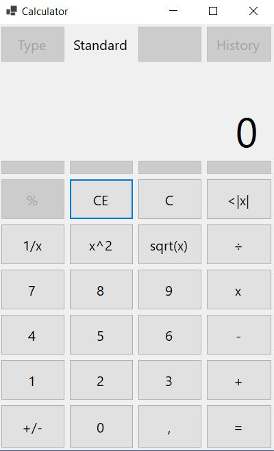

# Calculator

> MLH INIT Challenge

In the future I will add scientific mode but for now I will leave this as a standard calculator.



## Installation

Clone the repo
   ```sh
   git clone https://github.com/OscarSantos98/Calculator.git
   ```

## Development setup

### IDE

- [Visual Studio Community 2019](https://visualstudio.microsoft.com/es/vs/community/)

## Release History

* 0.1.0
    * Calculator under development.

## Follow me at

Twitter: [@OscarSantosMu](https://twitter.com/OscarSantosMu)  
Instagram: [oscarsantosmu](https://instagram.com/oscarsantosmu)